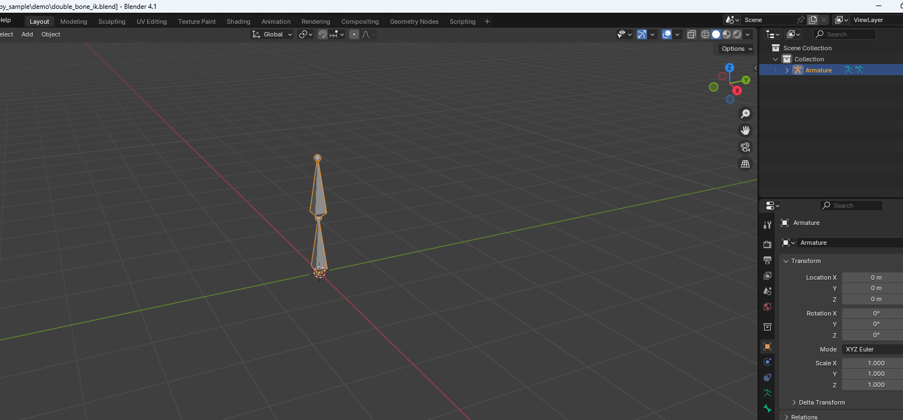
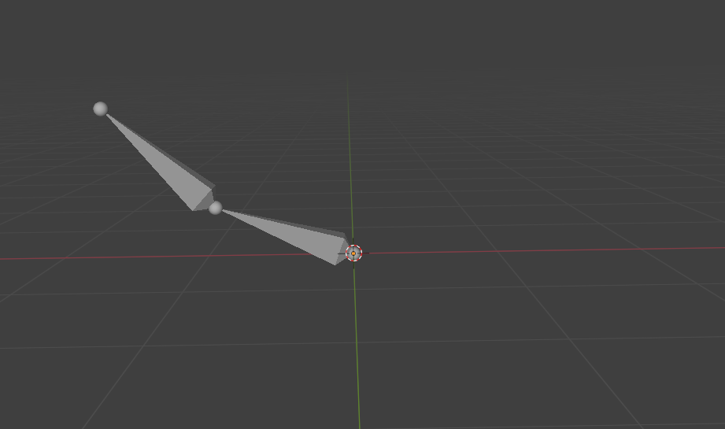
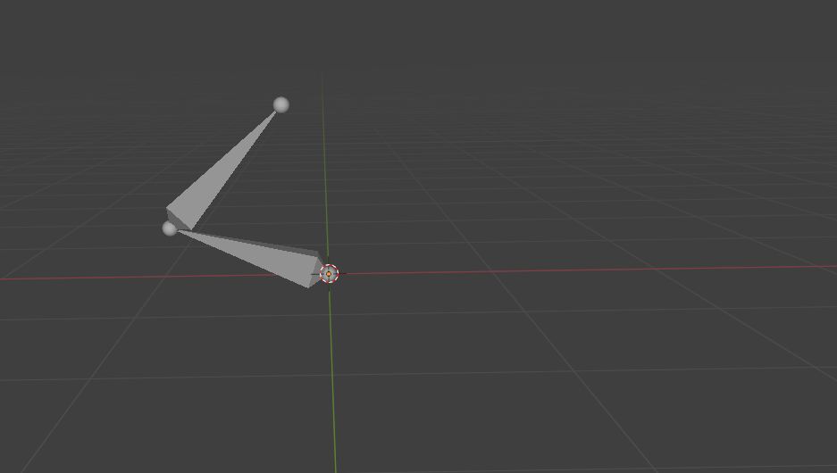
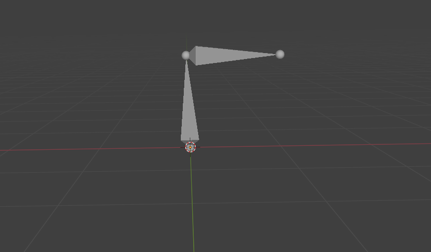

#! https://zhuanlan.zhihu.com/p/702879568
# Blender的另一面2：脚本动画IK

在之前的文章[搅拌机的另一面](https://zhuanlan.zhihu.com/p/702821017)中我们介绍了如何使用bpy当做一个python库直接使用blender，本文的目标就是深入介绍如何使用脚本使用blender的动画系统，并完成一个简单的inverse kinematic(逆运动学)

## 创建骨架

这里介绍一些Blender动画模块的核心概念，更详细的内容可以参考[官方文档](https://docs.blender.org/manual/en/latest/animation/index.html)

### 骨架 Armature

Blender中动画对应的object被称作骨架armature，做动画时候常说的“绑骨架”的意思就是把mesh和armature建立关联，然后用armature来驱动mesh的形变。

骨架包括了很多“骨骼”(bones)，每一个骨骼都可以绕着他们的“关节”(Joint)进行转动。所谓动画，其实就是构建很多关键帧(key frames)，每一个关键帧都有一个对应关节的姿态(pose)，然后将这些关键帧插值填满每一帧，就能得到每一帧对应的姿态，armature就做出对应的动作。


创建骨架的方法和创建mesh的方法如出一辙

```py
bpy.ops.object.armature_add(enter_editmode=True)
self.armature = bpy.context.object
```

### 骨骼 Bone

骨骼就是动物骨骼的抽象，包括了根节点 Root, 主体Body，以及末端Tip，每一个骨骼的末端可以用来连接其他骨骼的Root，这样连接起来的骨骼最终会构成一个骨架树结构，从根节点开始，每一个骨骼的末端连接着若干其他骨骼，最终连接成一个人体。


脚本中创建骨骼的方法是进入Edit Mode，然后操作骨骼，此处我们构建一个简单的DoubleBone，由两个骨骼顺次相连，类似一个机械臂。

```py
# root 是一个三维向量，代表根节点的位置
bpy.ops.object.mode_set(mode='EDIT')  # j进入EDIT MODE
bone = self.armature.data.edit_bones['Bone']
bone.name = bone_1_name
bone.head = root
bone.tail = (root[0], root[1], root[2] + bone_1_length)
# add bone
next_bone = self.armature.data.edit_bones.new(bone_2_name)
next_bone.head = bone.tail
next_bone.tail = (root[0], root[1], root[2] + bone_1_length + bone_2_length)
# hierarchy
next_bone.parent = bone
# 退出EDIT MODE，返回OBJECT MODE
bpy.ops.object.mode_set(mode='OBJECT')
self.bone_1().rotation_mode = 'XYZ'
self.bone_2().rotation_mode = 'XYZ'
```

想要设置骨骼的旋转，需要先进入POSE MODE，然后再退出，Blender这个方面显得略微繁琐

```py
bpy.ops.object.mode_set(mode='POSE')
self.bone_1().rotation_euler = rotation
bpy.ops.object.mode_set(mode='OBJECT')

```

### DoubleBone

整理一下上面介绍的代码，我们能用python结构体来定义DoubleBone，新建一个`bskeleton.py`写入如下代码：

```py
import bpy 
from typing import Tuple

class DoubleBone:
    def __init__(self, root: Tuple[float] = (0, 0, 0), bone_1_name: str = "bone_1", bone_1_length: float = 1.0, bone_2_name: str = "bone_2", bone_2_length: float = 1.0):
        self.bone_1_name = bone_1_name
        self.bone_1_length = bone_1_length
        self.bone_2_name = bone_2_name
        self.bone_2_length = bone_2_length  

        bpy.ops.object.armature_add(enter_editmode=True)
        self.armature = bpy.context.object
        bpy.ops.object.mode_set(mode='EDIT')
        bone = self.armature.data.edit_bones['Bone']
        bone.name = bone_1_name
        bone.head = root
        bone.tail = (root[0], root[1], root[2] + bone_1_length)
        # add bone
        next_bone = self.armature.data.edit_bones.new(bone_2_name)
        next_bone.head = bone.tail
        next_bone.tail = (root[0], root[1], root[2] + bone_1_length + bone_2_length)
        # hierarchy
        next_bone.parent = bone

        bpy.ops.object.mode_set(mode='OBJECT')
        self.bone_1().rotation_mode = 'XYZ'
        self.bone_2().rotation_mode = 'XYZ'

    def bone_1(self):
        return self.armature.pose.bones[self.bone_1_name]
    
    def set_bone_1_rotation(self, rotation: Tuple[float]):
        bpy.ops.object.mode_set(mode='POSE')
        self.bone_1().rotation_euler = rotation
        bpy.ops.object.mode_set(mode='OBJECT')

    def bone_2(self):
        return self.armature.pose.bones[self.bone_2_name]
    
    def set_bone_2_rotation(self, rotation: Tuple[float]):
        bpy.ops.object.mode_set(mode='POSE')
        self.bone_2().rotation_euler = rotation
        bpy.ops.object.mode_set(mode='OBJECT')

    def obj(self):
        return self.armature

```

这样我们就可以在 `double_bone_ik.py` 中简单新建一个骨架

```py
from bskeleton import DoubleBone
from bwrap import blender_executive
import bpy

@blender_executive
def double_bone_ik(rootdir):
    total_frames = 30
    bpy.context.scene.frame_start = 0
    bpy.context.scene.frame_end = total_frames
    double_bone = DoubleBone()

if __name__ == "__main__":
    double_bone_ik(subfolder="demo", filename="double_bone_ik")
```


结果如图所示，可以看到我们建立了一个串联机械臂



## 骨架IK

逆运动学，Inverse Kinematic，含义是给定骨架末端的轨迹，反求骨架的姿态。很明显，不同的姿态也可能让末端在同一个轨迹甚至同一个姿态上，所以逆运动学不一定存在唯一解，甚至解不一定存在（比如人手够不到的地方无论怎样调整姿势都够不到）。

在这里我们只是作为演示，不需要考虑优化，也不需要涉及复杂的边缘情况，我们选用最符合原理的Jacobian迭代方法来做逆运动学（引擎里常用的逆运动学算法大多是一些启发式算法，为了节省计算量）

我们已经构建了两个长度为1.0的骨骼，现在我们的目标是让骨架的末端从$(0,-\sqrt{3},1)$ 移动到 $(0,\sqrt{3},1)$ 简单的几何知识告诉我们从头到尾末端距离原点的距离都小于2，必然是有解的。

简单起见，我们只考虑骨骼在YZ平面上的移动，所以只需要考虑绕x轴的旋转，假设骨骼1绕x轴的旋转角度为$\theta_1$，骨骼2相对于骨骼1的旋转角度为$\theta_2$，每一个骨骼的长度均为1，那么末端姿态就容易求得 $\vec{p}(\theta_1,\theta_2)=(x_2,y_2)=(l_1\cos{\theta_1}+l_2\cos{(\theta_1+\theta_2)},l_1\sin{\theta_1}+l_2\sin{(\theta_1+\theta_2)})$

Jacobian矩阵指的是多元函数微积分中多元函数中每一个分量函数对变量中每一个分量偏导数构成的全导数矩阵


suppose $F:\mathbb{R}^n\rightarrow \mathbb{R}^n$ is m-dim vector function of a n-dim vector, Then 

$\vec{F}(\vec{x})=[f_1(\vec{x}),f_2(\vec{x}),\dots,f_m(\vec{x})]^T$

where $f_i(\vec{x})$ is a scalar function of vector x

Then at the point $\vec{p}$, we would like to know the gradient of this vector function of each component

$\frac{\partial \vec{F}}{\partial x_j}(\vec{p})=[\frac{\partial f_1}{\partial x_j}(\vec{p}),\frac{\partial f_2}{\partial x_j}(\vec{p}),\dots,\frac{\partial f_m}{\partial x_j}(\vec{p})]^T$

因此，全导数

$J=\left[\begin{matrix} \frac{\partial f_1}{\partial x_1} & \ldots & \frac{\partial f_1}{\partial x_n} \\  \vdots & \ddots  & \vdots \\ \frac{\partial f_m}{\partial x_1} & \ldots  & \frac{\partial f_m}{\partial x_n} \end{matrix}\right]$


在这个例子中，因为只有2阶，所以Jocobian还是可以手动计算的，当然对于更复杂的情况就不可取了，那时候需要用各种方法来近似得到Jacobian。

$$J = \left[\begin{matrix} \frac{\partial x_2}{\partial \theta_1} & \frac{\partial x_2}{\partial \theta_2} \\ \frac{\partial y_2}{\partial \theta_1} & \frac{\partial y_2}{\partial \theta_2} \end{matrix}\right] = 

\left[\begin{matrix}-l_1\sin{\theta_1} - l_2\sin{(\theta_1+\theta_2)} & -l_2\sin{(\theta_1+\theta_2)} \\ l_1\cos{\theta_1} + l_2\cos{(\theta_1+\theta_2)} & l_2\cos{(\theta_1+\theta_2)} \end{matrix}\right]$$

因为Jacobian意味着全导数，所以我们能用类似梯度下降的方法来利用终点优化姿态。

定义当前终点位置和目标位置之间的距离平方作为loss，我们有

$\mathcal{L}=\frac{1}{2}(\vec{p_t}-\vec{p})^2$，其中$\vec{p}=(x_2,y_2)$是当前的终点位置，$\vec{p_t}=(x_t,y_t)$ 是插值得到的终点位置，比方说我们打算设置$N_k$个关键帧，起点是$\vec{p_0}$终点是$\vec{p_1}$，那么每一轮迭代的$\vec{p}_{ti}=\vec{p}_0+\frac{i}{N_k}(\vec{p_1}-\vec{p_0})$

利用梯度下降，每一轮$\vec{\theta}=(\theta_1,\theta_2)$的偏导数可以写成

$$\frac{\partial \mathcal{L}}{\partial \vec{\theta}} = J^{-1}\frac{\partial \mathcal{L}}{\partial \vec{p}}$$

把上面这些数学推导写成python代码，就得到了我们简单的两骨骼IK

```py
from bskeleton import DoubleBone
from bwrap import blender_executive
import bpy
import numpy as np 

@blender_executive
def double_bone_ik(rootdir):
    total_frames = 30
    bpy.context.scene.frame_start = 0
    bpy.context.scene.frame_end = total_frames
    double_bone = DoubleBone()
    N_keyframes = 5
    target_height = 1
    max_offset = np.sqrt(3)
    pi = 3.1415926
    # initial
    # here we only consider the rotation of z axis (x,y) plane
    theta_1 = pi / 3
    # inverse calcuate next bone's rotation
    theta_2 = 0
    bone_1 = double_bone.bone_1()
    bone_2 = double_bone.bone_2()
    
    bpy.ops.object.mode_set(mode='POSE')

    for i in range(N_keyframes):
        frame = i * total_frames // N_keyframes
        target_end_position = (0, i / N_keyframes * 2 * max_offset - max_offset, target_height)

        steps = 100
        lr = 0.1
        for j in range(steps):
            end_position = (
                0,
                - bone_1.length * np.sin(theta_1) - bone_2.length * np.sin(theta_1 + theta_2),
                bone_1.length * np.cos(theta_1) + bone_2.length * np.cos(theta_1 + theta_2)
            )
            # inverse kinematics
            # Jacobian
            J = np.zeros((2, 2))
            J[0, 0] = - bone_1.length * np.cos(theta_1) - bone_2.length * np.cos(theta_1 + theta_2)
            J[1, 0] = - bone_2.length * np.cos(theta_1 + theta_2)
            J[0, 1] = - bone_1.length * np.sin(theta_1) - bone_2.length * np.sin(theta_1 + theta_2)
            J[1, 1] = - bone_2.length * np.sin(theta_1 + theta_2)
            # delta
            delta = np.zeros(2)
            delta[0] = target_end_position[1] - end_position[1]
            delta[1] = target_end_position[2] - end_position[2]
            # print("delta: ", delta)
            # update theta
            delta_theta = lr * np.linalg.pinv(J) @ delta
            # print("delta_theta: ", delta_theta)
            theta_1 = theta_1 + delta_theta[0]
            theta_2 = theta_2 + delta_theta[1]
            # clamp
            theta_1 = min(theta_1, 2 * pi)
            theta_1 = max(theta_1, 0)
            theta_2 = min(theta_2, 2 * pi )
            theta_2 = max(theta_2, 0)
            # update bone
        bone_1.rotation_euler = (0, 0, theta_1)
        bone_2.rotation_euler = (0, 0, theta_2)

        bone_1.keyframe_insert(data_path='rotation_euler', frame=frame)
        bone_2.keyframe_insert(data_path='rotation_euler', frame=frame)
    
    # return to object mode
    bpy.ops.object.mode_set(mode='OBJECT')

if __name__ == "__main__":
    double_bone_ik(subfolder="demo", filename="double_bone_ik")

```

最终的结果如图，虽然因为末端因为插值的缘故还有点问题，但是作为展示已经足够了，我们看到一个机械臂如我们所想象地那样沿着同一高度运行。






