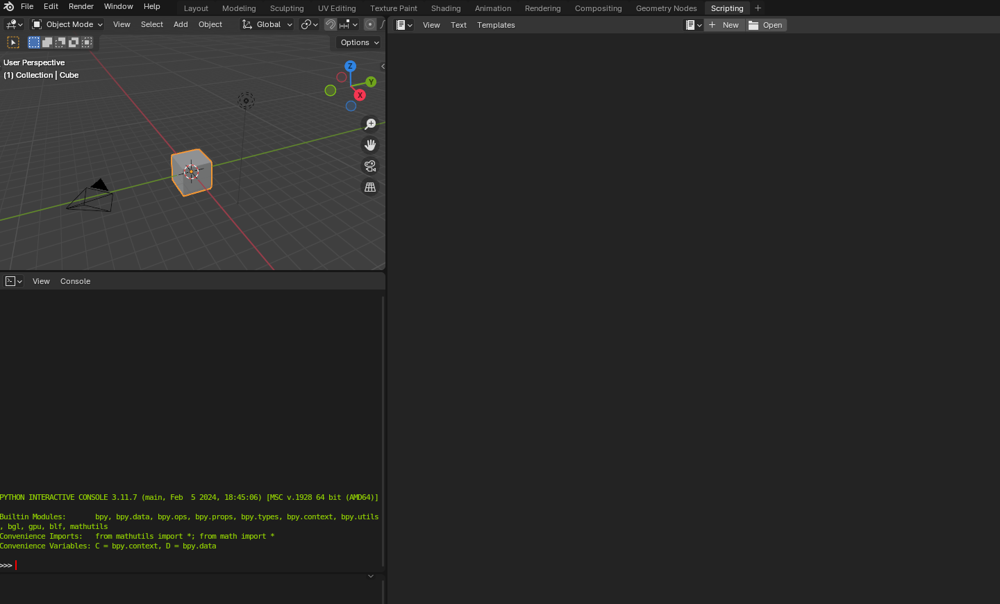
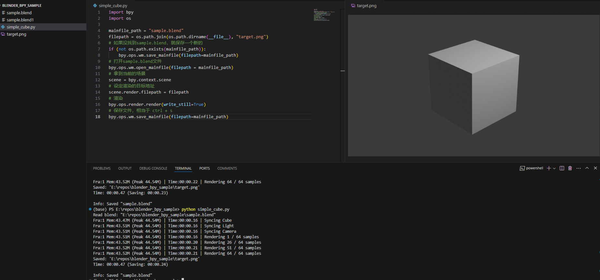
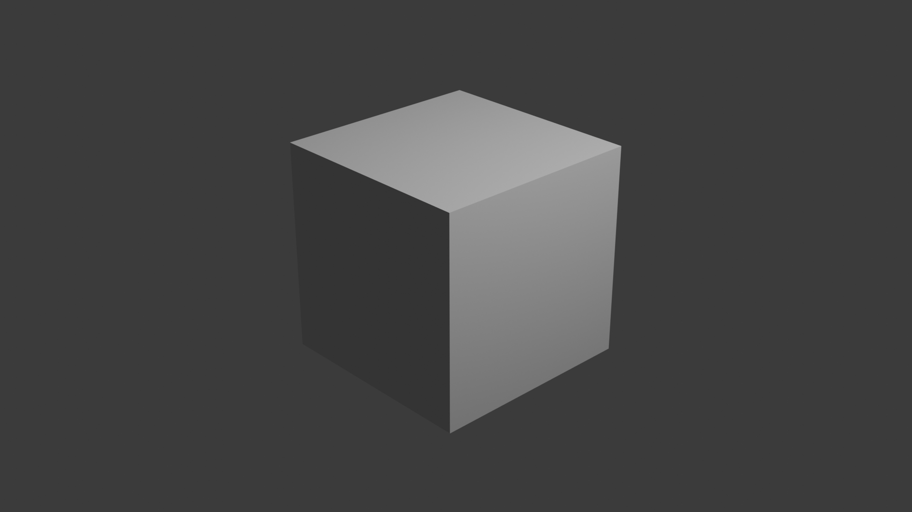
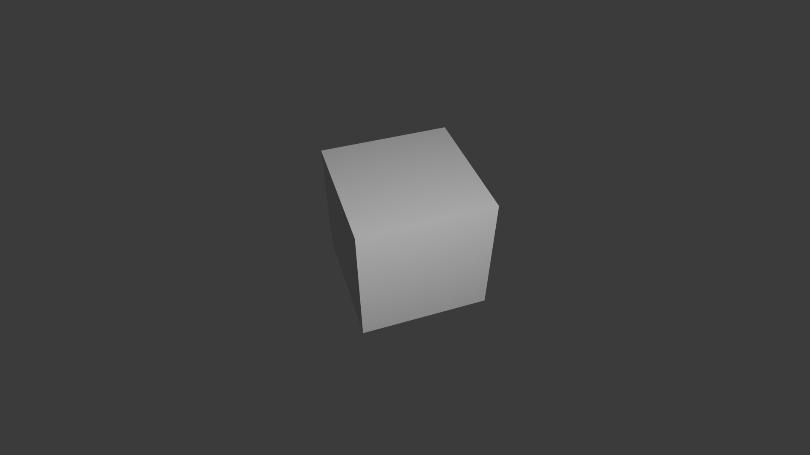

#! https://zhuanlan.zhihu.com/p/702821017
# 搅拌机的另一面 Another Side of Blender



文章和代码同步在github: [github](https://github.com/sailing-innocent/another_side_of_blender.git)

blender是一个轻量好用的开源建模软件，同时也包含了不少渲染和特效功能。但程序员们上手blender总有些不适应，更习惯跟着图文代码验证而不习惯跟着教程视频一步步走，更习惯直接设定数值而不是慢慢凭感觉调整。但很不幸，市面上九成九的blender教程都是面向美术的，不幸中的万幸在于，blender提供了一种邪道用法：直接将整个blender作为一个python module来导入。

也许你会说，啊我知道blender有脚本功能啊，毕竟哪个大型软件没有？不就是写几十行python脚本运行吗？但是有脚本也没用，用blender内置环境里那个糟糕的编辑器能和我平时用vscode写的python工程一样快乐吗？能封装吗？能复用吗？能接数据库吗？能嵌入python的生态吗？numpy? pytorch? 难不成我还需要在blender里面安装一套工具链？

喘口气，别急，原则上还真是可以的。blender的插件实现原理，其实就是把一些C++操作编译成动态库，把dll改个后缀名叫pyd，你就可以用python调用了。事实上，blender的本体是一个运行在内存中，用来编辑你的.blend文件，同时输出若干图片的程序。这个程序提供了两种与它打交道的方式：GUI点点点和python binding的脚本，同时内置了一个python解释器用来解释执行这些bind的脚本，你可以用childprocess调用blender内置的pip来安装你所需要的库。

不过这不是本文的重点，本文要讲的是另一种：直接在你的python环境中使用blender，`pip install bpy`，和你使用任何其他python库，比如pytorch, tensorflow, numpy, matplotlib等……完全一样。

上文说过，blender的本体其实是一个运行在内存里的程序，GUI并非刚需，事实上你只需要在打开`blender.exe`的时候加上`-b`，就可以让blender后台运行，这在一些批处理和后台渲染任务的时候特别有用。而`pip install bpy`实际上就是安装了一个不带GUI，只能后台运行的blender版本，如果你有尝试精神，你也可以自己去玩blender的源码，加上cmake符号WITH_PYTHON_MODULE之后就能编译出来一样的东西。

## 安装bpy

`pip install bpy`

用pip直接安装即可。国内的朋友如果嫌下载慢可以使用国内镜像，比如`pip install bpy -i https://pypi.mirrors.ustc.edu.cn/simple/`。不过需要注意一点，blender对于你的python版本有所要求，目前blender2.8版本对应python3.7-3.8，blender3.x以上版本对应python3.10.x，blender 4.x以上的环境对应python 3.11。如果版本不一致，后续可能会出现许多问题，比方说你有一个自己写的C++渲染引擎，想要把自己的引擎替换blender的默认引擎，这时候就得保证你pybind link的python版本和blender的版本一致，推荐使用conda之类的工具来创建一个虚拟环境使用。`conda create -n blenv python=3.11`, `pip install bpy` 即可。

好了，现在我们安装好了，来做点什么吧。

## 渲染一个立方体

随便找一个地方，新建一个python文件 `simple_cube.py`，众所周知，blender开屏时候有一个经典的立方体（如果你没有做额外设置的话），那么我们就尝试一下什么都不做，用python脚本创建一个blend文件，打开，并渲染那个默认的立方体到`target.png`文件里

```py
import bpy
import os 

mainfile_path = "sample.blend"
filepath = os.path.join(os.path.dirname(__file__), "target.png")
# 如果没找到sample.blend，就保存一个新的
if (not os.path.exists(mainfile_path)):
    bpy.ops.wm.save_mainfile(filepath=mainfile_path)
# 打开sample.blend文件
bpy.ops.wm.open_mainfile(filepath = mainfile_path)
# 拿到当前的场景
scene = bpy.context.scene 
# 设定渲染的目标地址
scene.render.filepath = filepath
# 渲染
bpy.ops.render.render(write_still=True)
# 保存文件，相当于 ctrl + s
bpy.ops.wm.save_mainfile(filepath=mainfile_path)
```

这时候你的整个工作区可能会像图中我用vscode这样



目录下保存了一个`sample.blend`，这就是你创建的工程文件，另外还有一个`sample.blend1`这个是缓存，不必管它，此外还有`target.png`，这就是我们期待的立方体图片了。



### 简单封装一下

当然这样直接使用还是太繁琐了，我们将其中用到的东西封装到`ops.py`中，加上点额外的清除功能，

```py
import bpy 
import os 

def bopen(mainfile_path='sample.blend', clear=True):
    # INIT SAVE
    if (not os.path.exists(mainfile_path)):
        bpy.ops.wm.save_mainfile(filepath=mainfile_path)

    bpy.ops.wm.open_mainfile(filepath = mainfile_path)
    if (clear):
        bclear()

def bclose(mainfile_path='sample.blend'):
    bpy.ops.wm.save_mainfile(filepath=mainfile_path)

def bclear():
    # remove all elements
    # object mode
    # test if there is any object
    if (len(bpy.data.objects) == 0):
        return

    bpy.ops.object.select_all(action="SELECT")
    bpy.ops.object.delete(use_global=False)
    # set cursor to (0, 0, 0)
    bpy.context.scene.cursor.location = (0, 0, 0)

def brender(rootdir: str, filename: str):
    scene = bpy.context.scene 
    scene.render.filepath = os.path.join(rootdir, filename)
    bpy.ops.render.render(write_still=True)

```

这样同样功能的代码就可以写成这样

```py
from bops import bopen, bclose, brender
import os 
mainfile_path = "sample.blend"
bopen(mainfile_path, clear=False)
brender(os.path.dirname(__file__), "target.png")
bclose(mainfile_path)
```

### 再封装一下

不难发现我们每一次脚本都需要写一轮bopen, bclose，未免有些繁琐，有没有modern的写法呢，有的，那就是用python的装饰器，decorator

装饰器其实就是一种高阶函数，将当前定义的函数本身作为一个参数传入，我们写一个`blender_executive`装饰器

新建`bwrap.py`文件夹，里面写一个装饰器 

```py
from functools import wraps
from bops import bopen, bclose
import os 

def blender_executive(func):
    @wraps(func)
    def wrapper(
        subfolder: str = "subfolder", 
        filename: str = "filename",
        clear: bool = True,
        **kwargs
    ):
        blender_root = os.path.dirname(__file__)
        rootdir = os.path.join(blender_root, subfolder)
        if not os.path.exists(rootdir):
            os.makedirs(rootdir)
        name = filename
        mainfile_path = os.path.join(rootdir, name + ".blend")
        bopen(mainfile_path, clear=clear)
        # core func
        func(rootdir, **kwargs)
        # save and close
        bclose(mainfile_path)
    return wrapper
```

这样同样功能的代码就可以写成这样

```py
from bwrap import blender_executive
from bops import brender 

@blender_executive
def dummy_render(rootdir):
    brender(rootdir, 'dummy_render.png')

if __name__ == "__main__":
    dummy_render(subfolder="demo", filename="dummy_render", clear=False)
```

这样就modern起来了！你可以随意修改里面的blender_root为你期望保存的blender工程文件夹地址

## 创建场景

之前我们都是用默认场景工作，完全没有做任何改动。从这里开始我们尝试用脚本编辑场景，并在所有工作之前，将clear设置为True，也就是说会默认删掉全部的场景，blender的场景入口其实之前已经接触到了，就是`bpy.scene`。对于任何一个三维场景，其必不可少的要素有三个

- object: 渲染的模型，一般是三角网格
- light: 要有光
- camera: 要有个相机

接下来我们就依次创建这三个对象，这一次我们的目标仍然是创建一个简单的立方体场景，不过上一次是默认创建的，这一次我们来玩手动档。

### Mesh

新建一个`bopj.py`文件夹

```py
import bpy 
def add_cube():
    # create object
    bpy.ops.mesh.primitive_cube_add(location=(0,0,0))
    obj = bpy.context.object
    return obj
```

其实blender给了一个快速创建立方体的操作，直接用即可，在创建灯光和相机之前，我们还需要一个函数来让创建对象“看向”我们的立方体，无论是灯光还是相机。这可以通过构建一个“约束”来实现，让目标的-z指向对应的物体

```py
def track_to_constraints(obj, target):
    constraint = obj.constraints.new('TRACK_TO')
    constraint.target = target 
    constraint.track_axis = 'TRACK_NEGATIVE_Z'
    constraint.up_axis = 'UP_Y'
```

### Light

```py
# ...
def create_basic_light(origin, type='POINT', energy=1000, color=(1,1,1), target=None):
    # Light types: 'POINT', 'SUN', 'SPOT', 'HEMI', 'AREA'
    bpy.ops.object.add(type='LIGHT', location=origin)
    obj = bpy.context.object
    obj.data.type = type
    obj.data.energy = energy
    obj.data.color = color
    if target: 
        track_to_constraints(obj, target)
    return obj
```

### Camera


```py
# ...
def create_basic_camera(origin, target=None, camera_type='PERSP', lens=25, clip_start=0.1, clip_end=100, ortho_scale=6):
    # Create object and camera
    camera = bpy.data.cameras.new("Camera")
    camera.lens = lens 
    camera.clip_start = clip_start 
    camera.clip_end = clip_end 
    camera.type = camera_type # 'PERSP', 'ORTHO', 'PANO'
    if (camera_type == 'ORTHO'):
        camera.ortho_scale = ortho_scale

    # Link Object to Scene 
    obj = bpy.data.objects.new("CameraObj", camera)
    obj.location = origin 
    bpy.context.collection.objects.link(obj)
    bpy.context.scene.camera = obj # Make Current
    
    if target: 
        track_to_constraints(obj, target)

    return obj 

```

### 合并场景

终于我们开始合并上面写好的场景！

```py
# Simple Blender Scene

import bpy 
import mathutils 

def simple_cube():
    obj = add_cube()
    camera = create_basic_camera(origin=mathutils.Vector((2, 6, 6)), target=obj)
    light  = create_basic_light(origin=mathutils.Vector((0, 5, 5)), target=obj)
    return obj, camera, light
```

这样我们就构造了一个函数simple_cube()，它会构建一个麻雀虽小五脏俱全的场景，之后我们都会在这个基础上展开

经过层层封装之后，最终的代码显得简单可爱：

```py
from bwrap import blender_executive
from bops import brender 
from bobj import simple_cube

@blender_executive
def manual_cube(rootdir):
    simple_cube()
    brender(rootdir, 'manual_cube.png')

if __name__ == "__main__":
    manual_cube(subfolder="demo", filename="manual_cube")
```

最后得到的场景类似这样：

## 小结

至此其实我们已经形成了一套工作流，之后的事情其实和你直接使用blender脚本的区别不大了，这一套的缺点在于没有GUI不够直观，但是好处非常明显，就是可以无缝衔接其他强大的python功能，做动画，做可视化，用pytorch，用你自己的pybind渲染器，连数据库，连网络，搭服务器……想象力可以更丰富些。

之后我还打算分享一些使用blender创作动画，怎么使用自己的渲染引擎，做一些简单的噪声地形，编辑材质纹理之类的，敬请期待。

- 使用Blender脚本来写Jacobian IK [文章](https://zhuanlan.zhihu.com/p/702879568)
- 注册自己的渲染引擎：TODO